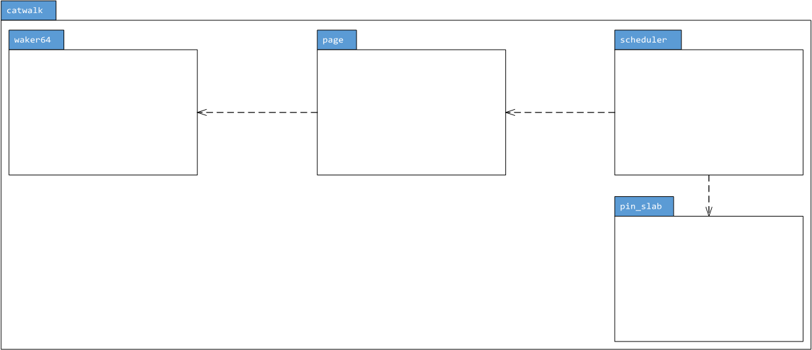
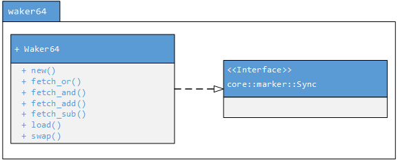
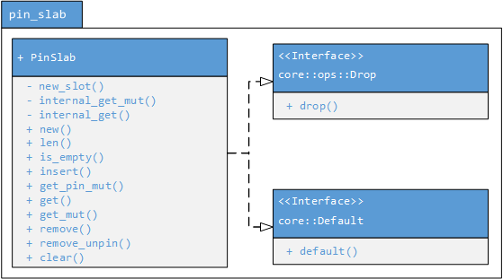
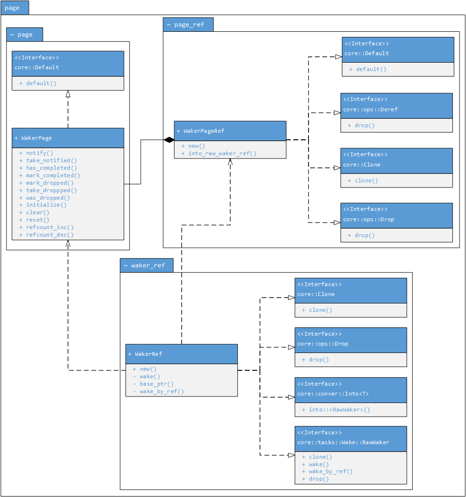
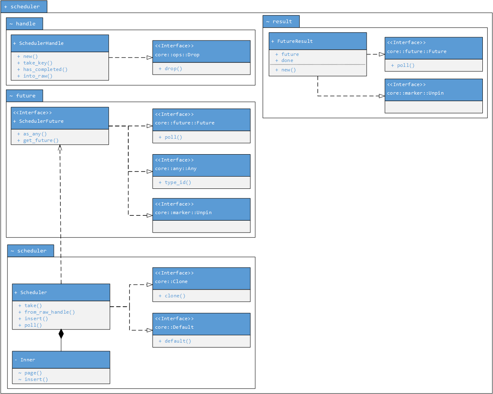

Architectural Diagrams
=======================

- [Package Overview (`scheduler`)](#package-overview)
- [64-Bit Waker Module (`scheduler::waker64`)](#64-bit-waker-module)
- [Pinned Slab Module (`scheduler::pin_slab`)](#pinned-slab-module)
- [Page Module (`scheduler::page`)](#page-module)
- [Scheduler Module (`scheduler::scheduler`)](#scheduler-module)

Package Overview
-----------------

64-Bit Waker Module
---------------

Pinned Slab Module
-------------

Page Module
---------------

Scheduler Module
------------

